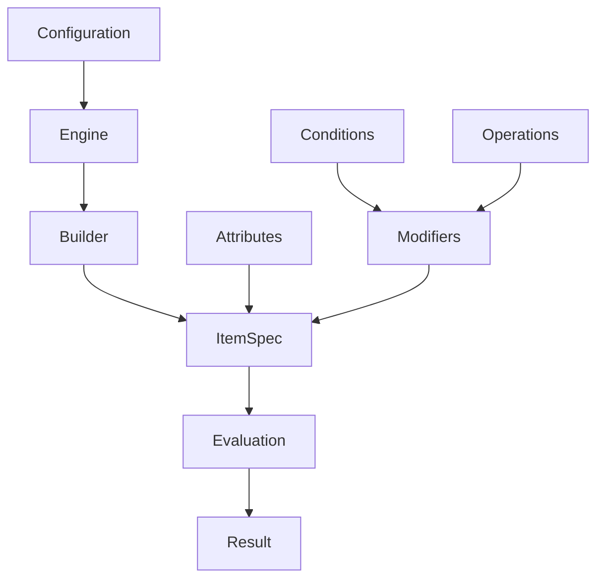

# Core Concepts Overview

Mod-Engine is built around several key concepts that work together to create a powerful and flexible modification system. Understanding these concepts will help you build effective and maintainable systems.

## Architecture Overview



## Core Components

### 1. Configuration

The foundation of your system. Defines:

- **Metrics** - The values that can be modified (e.g., Health, Damage)
- **Operations** - How modifiers change metrics (e.g., sum, multiply)
- **Attributes** - Properties that items can have (e.g., Rarity, Level)

### 2. Engine

The central coordinator that:

- Validates configurations
- Creates builders for items
- Evaluates items against modifiers
- Ensures type safety throughout

### 3. Items and Attributes

Items are objects with named attributes that describe their properties:

- **Enum attributes** - Fixed sets of values (e.g., Rarity: Common, Rare, Epic)
- **Boolean attributes** - True/false values (e.g., Enchanted, Cursed)
- **Number attributes** - Numeric values with optional ranges (e.g., Level: 1-100)
- **String attributes** - Text values with optional patterns

### 4. Modifiers

Rules that change item metrics:

- **Operations** - How the modification is applied (sum, multiply, etc.)
- **Values** - The amount of modification
- **Conditions** - When the modifier applies
- **Priorities** - Order of application
- **Stacking** - How multiple instances combine

### 5. Evaluation

The process of applying all valid modifiers to calculate final metrics:

- Filters modifiers by conditions
- Sorts by priority
- Applies operations in sequence
- Tracks the complete evaluation history

## Data Flow

1. **Configuration Phase**

   - Define metrics, operations, and attributes
   - Create and validate the engine

2. **Building Phase**

   - Set item attributes
   - Add modifiers with conditions
   - Build the complete item specification

3. **Evaluation Phase**
   - Start with base metrics (typically 0)
   - Filter modifiers by item attributes
   - Apply valid modifiers in priority order
   - Generate final metrics and audit trail

## Key Principles

### Type Safety

Everything is strictly typed at compile time:

```typescript
// This will cause a TypeScript error if "InvalidMetric" isn't defined
.increase("InvalidMetric") // ❌ Compile error
.increase("Health")        // ✅ Valid
```

### Determinism

Given the same inputs, evaluation always produces the same outputs:

```typescript
const result1 = engine.evaluate(item);
const result2 = engine.evaluate(item);
// result1.metrics === result2.metrics (always true)
```

### Immutability

Items and configurations are immutable once created:

```typescript
const item = builder.build(); // Item is now immutable
const result = engine.evaluate(item); // Doesn't modify the item
```

### Composability

Systems can be built incrementally and combined:

```typescript
const baseWeapon = engine.builder("Sword").increase("Damage").by(10);

const enchantedWeapon = baseWeapon
  .set("Enchanted", true)
  .when({ op: "eq", attr: "Enchanted", value: true })
  .multiply("Damage")
  .by(1.5);
```

## Next Steps

Now that you understand the overall architecture:

- [Items and Attributes](./items-and-attributes.md) - Learn about item properties
- [Builder API](../api/builder.md) - Understand modification rules
- [Evaluation API](../api/evaluation.md) - See how calculations work
- [Conditions API](../api/conditions.md) - Master conditional logic
- [Operations API](../api/operations.md) - Explore available operations
